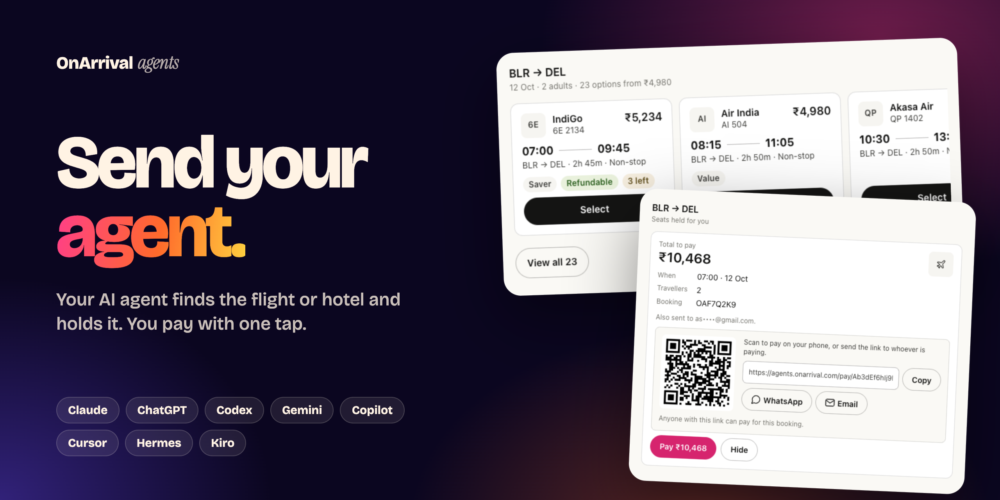
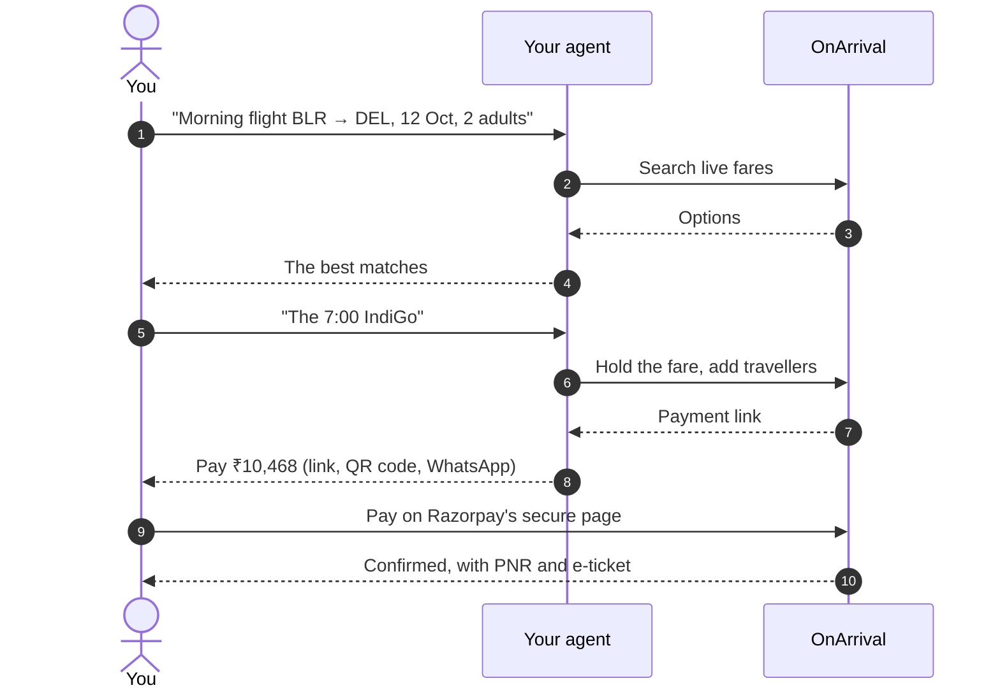
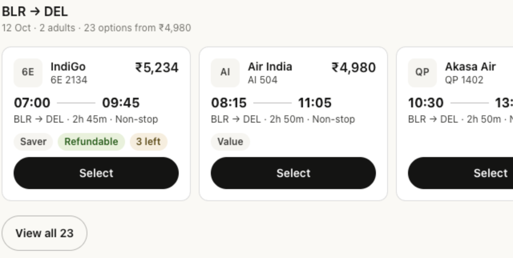
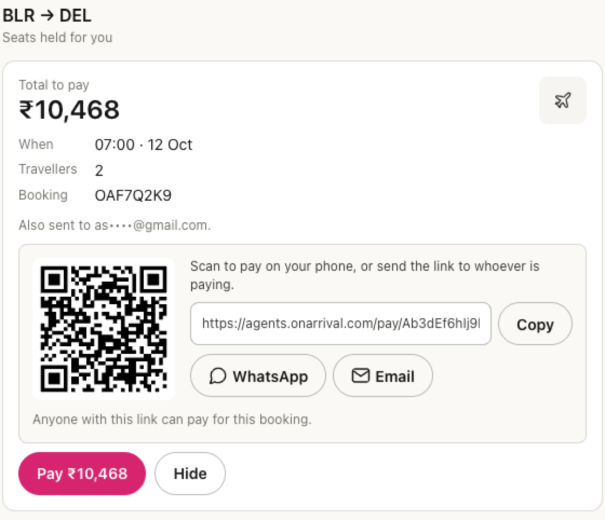
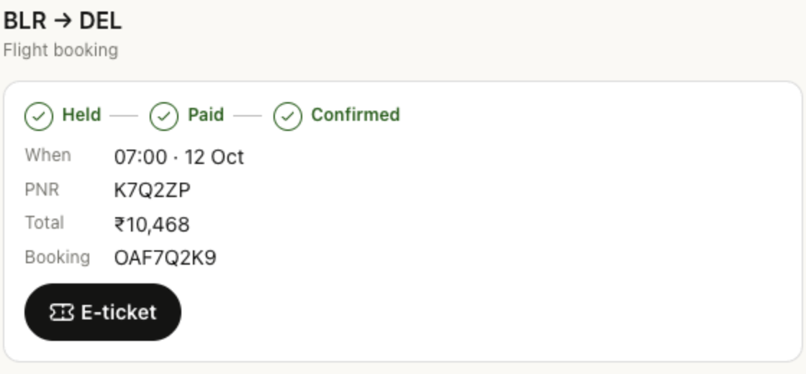
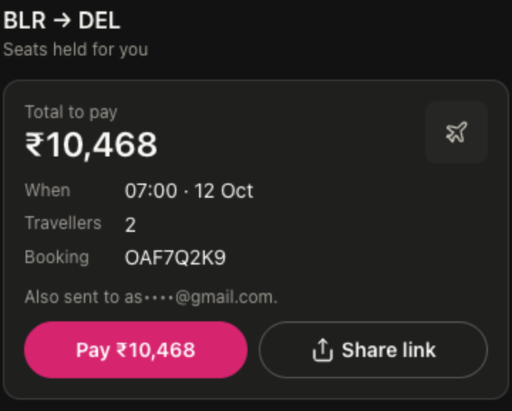

<p align="center">
  <a href="https://www.onarrival.com/send-your-agent"></a>
</p>

<h1 align="center">OnArrival for your AI agent</h1>

<p align="center">
  <strong>Book flights and hotels from Claude, ChatGPT, Codex, Gemini, Copilot, Cursor, Hermes, Kiro and any MCP client.</strong><br>
  Your agent searches live fares, compares options and holds the booking on your OnArrival account. You pay with one link.
</p>

<p align="center">
  <a href="https://modelcontextprotocol.io"></a>
  <a href="https://github.com/modelcontextprotocol/ext-apps"></a>
  <a href="https://agentskills.io"></a>
  <a href="https://agents.onarrival.com"></a>
</p>

<p align="center">
  <a href="https://agents.onarrival.com"><strong>Sign up</strong></a> ·
  <a href="#install">Install</a> ·
  <a href="#how-it-works">How it works</a> ·
  <a href="#interactive-cards">Interactive cards</a> ·
  <a href="#security-and-privacy">Security</a> ·
  <a href="#faq">FAQ</a>
</p>

> [!NOTE]
> **Sign up free at [agents.onarrival.com](https://agents.onarrival.com)**, then connect your agents. In ChatGPT and Claude you can also just add the OnArrival app and sign in when asked.

## Just ask

> *"Find me a morning flight from Bengaluru to Delhi on 12 October for two adults, non-stop, under ₹6,000."*

> *"Book a 4-star hotel near Connaught Place for 12–14 October with free cancellation."*

> *"I've paid. Is my booking confirmed? Send me the PNR."*

Your agent does the searching and the forms. You stay in control of the money: **nothing is booked until you pay**.

| | Flights | Hotels |
| --- | --- | --- |
| **Search** | One-way and round trips, any cabin, adults, children and infants | Cities, areas, landmarks or a specific hotel, any number of rooms |
| **Compare** | Price, times, stops, duration, fare families and refundability | Star rating, guest rating, reviews, rooms, inclusions, cancellation terms |
| **Book** | Travellers from your saved profiles, plus seats, meals and bags | Guests from your saved profiles, with PAN or passport where required |
| **Pay** | One secure payment link, which you or anyone you send it to can pay | Same |
| **After** | Live status, PNR and e-ticket | Live status, confirmation number and voucher |

## How it works



1. **Your agent searches** OnArrival's live inventory and shows you the best options.
2. **You choose.** Your agent holds the fare and adds travellers from your saved profiles, asking before it creates anyone new.
3. **You get one payment link.** It also goes to your email. Pay it yourself, or forward it to whoever is paying. Payment happens on Razorpay's secure page; your agent never pays or sees card details.
4. **It's confirmed.** Your agent follows the booking to confirmation and hands you the PNR and e-ticket, or the hotel voucher.

## Interactive cards

In apps that render [MCP Apps](https://github.com/modelcontextprotocol/ext-apps) (**ChatGPT, Claude, VS Code and Goose**), results appear as native-looking cards right in the conversation. They follow each app's own light and dark theme. Everywhere else, your agent gets the same information as text.

<table>
  <tr>
    <td width="52%" valign="top"></td>
    <td width="48%" valign="top"></td>
  </tr>
  <tr>
    <td valign="top"><strong>Compare and choose.</strong> Swipe through options, or open full screen to sort by price, speed or time and filter by stops. Choosing an option tells your agent to book it.</td>
    <td valign="top"><strong>Pay, or send it on.</strong> Pay in one tap, or share the link by QR code, WhatsApp, email or copy. The card follows the payment live.</td>
  </tr>
  <tr>
    <td valign="top"></td>
    <td valign="top" align="center"></td>
  </tr>
  <tr>
    <td valign="top"><strong>Booked.</strong> Held → paid → confirmed, with the PNR and your e-ticket a tap away.</td>
    <td valign="top"><strong>At home on phones.</strong> Full-width, thumb-friendly and in the app's dark mode.</td>
  </tr>
</table>

## Install

**1. Get your connection key.** Sign in at [agents.onarrival.com](https://agents.onarrival.com) and create a connection for your agent. Its MCP URL looks like `https://mcp.onarrival.com/u/oa_agt_…/mcp`, and the `oa_agt_…` part is your **connection key**. For command-line agents, put the key in your shell profile:

```bash
export ONARRIVAL_CONNECTION=oa_agt_…
```

**2. Add OnArrival to your agent.**

| Agent | Install |
| --- | --- |
| **Claude Code** | `/plugin marketplace add OnArrival/agent-plugins` then `/plugin install onarrival@onarrival` |
| **Codex** | `codex plugin marketplace add OnArrival/agent-plugins` then `codex plugin add onarrival@onarrival` |
| **Gemini CLI** | `gemini extensions install https://github.com/OnArrival/agent-plugins` |
| **GitHub Copilot CLI** | `copilot plugin marketplace add OnArrival/agent-plugins` then `copilot plugin install onarrival@onarrival` |
| **Hermes** | `hermes mcp add onarrival --url https://mcp.onarrival.com/mcp --auth header` |
| **Claude** (web, desktop) | Custom connector with your personal MCP URL. [Steps](#claude-web-and-desktop) |
| **ChatGPT** | Developer-mode plugin with your personal MCP URL. [Steps](#chatgpt) |
| **Cursor · VS Code · Windsurf · Kiro · Goose · OpenClaw** | [See below](#more-agents) |
| **Any MCP client** | `https://mcp.onarrival.com/mcp` with `Authorization: Bearer oa_agt_…` |

**3. Ask for a trip.** That's it.

<details>
<summary><strong>Claude Code</strong></summary>

```
/plugin marketplace add OnArrival/agent-plugins
/plugin install onarrival@onarrival
```

Or from a terminal: `claude plugin marketplace add OnArrival/agent-plugins`, then `claude plugin install onarrival@onarrival`. Claude Code reads `ONARRIVAL_CONNECTION` when it starts. Check the connection with `claude mcp list`. The plugin brings the MCP server and both booking skills.

</details>

<details>
<summary><strong>Codex</strong> (CLI, IDE and app)</summary>

```bash
codex plugin marketplace add OnArrival/agent-plugins
codex plugin add onarrival@onarrival
```

Codex sends `ONARRIVAL_CONNECTION` as a bearer token. `codex mcp list` shows the server.

</details>

<details>
<summary><strong>Gemini CLI</strong></summary>

```bash
gemini extensions install https://github.com/OnArrival/agent-plugins
```

Gemini CLI reads `ONARRIVAL_CONNECTION` from your environment. Check the connection with `gemini mcp list`.

</details>

<details>
<summary><strong>GitHub Copilot CLI</strong></summary>

```bash
copilot plugin marketplace add OnArrival/agent-plugins
copilot plugin install onarrival@onarrival
```

Copilot CLI uses the same plugin as Claude Code and reads `ONARRIVAL_CONNECTION` when it starts. `copilot mcp get onarrival` shows the server.

</details>

<details>
<summary><strong>Hermes</strong></summary>

```bash
hermes mcp add onarrival --url https://mcp.onarrival.com/mcp --auth header
hermes skills install OnArrival/agent-plugins/skills/onarrival-flights
hermes skills install OnArrival/agent-plugins/skills/onarrival-hotels
```

When `hermes mcp add` asks for an API key, paste your connection key. Hermes keeps it in `~/.hermes/.env` and connects to list the tools. Start a new session to use them.

</details>

### Claude (web and desktop)

In Claude, open **Customize → Connectors → Add custom connector**. Name it **OnArrival**, paste your personal MCP URL (`https://mcp.onarrival.com/u/oa_agt_…/mcp`) and choose no sign-in. Then turn the connector on in a chat. Results show as interactive cards.

### ChatGPT

Turn on developer mode (**Settings → Security and login → Developer mode**), then add a plugin with your personal MCP URL and no authentication. Developer mode depends on your ChatGPT plan. Results show as interactive cards.

### More agents

<details>
<summary><strong>Cursor</strong></summary>

**As a plugin:** in the Cursor dashboard, go to **Plugins & MCPs → Team Marketplaces → Import from Repo** and paste `https://github.com/OnArrival/agent-plugins`. The plugin brings the server and both skills.

**Just the server:** with `ONARRIVAL_CONNECTION` set, [add OnArrival to Cursor](cursor://anysphere.cursor-deeplink/mcp/install?name=onarrival&config=eyJ1cmwiOiJodHRwczovL21jcC5vbmFycml2YWwuY29tL21jcCIsImhlYWRlcnMiOnsiQXV0aG9yaXphdGlvbiI6IkJlYXJlciAke2VudjpPTkFSUklWQUxfQ09OTkVDVElPTn0ifX0%3D), or add it to `~/.cursor/mcp.json`:

```json
{
  "mcpServers": {
    "onarrival": {
      "url": "https://mcp.onarrival.com/mcp",
      "headers": { "Authorization": "Bearer ${env:ONARRIVAL_CONNECTION}" }
    }
  }
}
```

</details>

<details>
<summary><strong>VS Code</strong> (GitHub Copilot)</summary>

Add this to `.vscode/mcp.json` in a workspace, or to your user MCP configuration. VS Code asks for the key once and stores it securely. Results show as interactive cards.

```json
{
  "inputs": [
    { "type": "promptString", "id": "onarrival-connection", "description": "OnArrival connection key (oa_agt_…)", "password": true }
  ],
  "servers": {
    "onarrival": {
      "type": "http",
      "url": "https://mcp.onarrival.com/mcp",
      "headers": { "Authorization": "Bearer ${input:onarrival-connection}" }
    }
  }
}
```

</details>

<details>
<summary><strong>Windsurf</strong></summary>

Add this to your MCP config (`mcp_config.json`):

```json
{
  "mcpServers": {
    "onarrival": {
      "serverUrl": "https://mcp.onarrival.com/mcp",
      "headers": { "Authorization": "Bearer ${env:ONARRIVAL_CONNECTION}" }
    }
  }
}
```

</details>

<details>
<summary><strong>Kiro</strong></summary>

In Kiro's Powers panel, choose **Add Custom Power → Import power from GitHub** and enter `https://github.com/OnArrival/agent-plugins`. The OnArrival power is in `powers/onarrival`. Kiro reads `ONARRIVAL_CONNECTION` for the key.

</details>

<details>
<summary><strong>Goose</strong></summary>

Run `goose configure`, choose **Add Extension → Remote Extension (Streamable HTTP)**, name it `onarrival` and enter your personal MCP URL (`https://mcp.onarrival.com/u/oa_agt_…/mcp`). In Goose Desktop, add a custom extension of type Streamable HTTP with the same URL. Results show as interactive cards.

</details>

<details>
<summary><strong>OpenClaw</strong></summary>

Add a remote MCP server named `onarrival` that uses streamable HTTP, with your personal MCP URL (`https://mcp.onarrival.com/u/oa_agt_…/mcp`), which carries the key itself. Copy the `skills/` folders into your OpenClaw skills folder.

</details>

<details>
<summary><strong>Skills for Amp, Antigravity, OpenCode and more</strong></summary>

The two booking skills work in any agent that reads [Agent Skills](https://agentskills.io):

```bash
npx skills add OnArrival/agent-plugins -g
```

Then connect the MCP server in that agent.

</details>

<details>
<summary><strong>Any other MCP client</strong></summary>

Use streamable HTTP with either:

- `https://mcp.onarrival.com/mcp` and the header `Authorization: Bearer oa_agt_…`, or
- your personal URL, `https://mcp.onarrival.com/u/oa_agt_…/mcp`, for clients that can't send headers.

</details>

## Paying for a booking

- **One link per booking.** It opens OnArrival's payment page, which hands over to Razorpay's secure checkout. The link is also emailed to you.
- **Pay from anywhere.** Scan the QR code to pay on your phone, or send the link by WhatsApp or email to whoever is paying.
- **You pay, not your agent.** Your agent hands you the link; the payment itself happens on Razorpay's page.
- **Fares are re-checked** when you pay. If the price has changed, you see the new amount before paying.

## Security and privacy

- **One key per agent.** Each agent gets its own connection, so you can revoke one without touching the others. Revoking takes effect within a minute.
- **Keys are stored hashed.** OnArrival shows a connection link once and stores only a hash of it. Treat it like a password, and revoke it at [agents.onarrival.com](https://agents.onarrival.com) if it leaks.
- **Agents never see card details.** Payment happens on Razorpay's hosted checkout. Agents only ever get the payment link.
- **Nothing is booked until it's paid,** so an agent can't spend money on its own.

## FAQ

<details>
<summary><strong>Which agents work best?</strong></summary>

Agents that speak MCP (Claude, ChatGPT, Codex, Gemini, Copilot, Cursor, Hermes) use OnArrival's tools directly. ChatGPT, Claude, VS Code and Goose also show interactive cards. Browser agents such as Muse and Instinct use OnArrival's agent-friendly website instead: create a connection for them at [agents.onarrival.com](https://agents.onarrival.com) and give them its website link.

</details>

<details>
<summary><strong>Do I need a new account?</strong></summary>

Sign up at [agents.onarrival.com](https://agents.onarrival.com) with Google or your email, and your OnArrival account is set up. Bookings made by your agents appear under **Bookings** at [agents.onarrival.com](https://agents.onarrival.com).

</details>

<details>
<summary><strong>What if my agent picks the wrong option?</strong></summary>

Nothing is booked until the payment link is paid, and the payment page shows the trip and the total first. Ask your agent to search again, or just don't pay the link.

</details>

<details>
<summary><strong>Can someone else pay?</strong></summary>

Yes. Anyone with the payment link can pay it, so send it to whoever is paying, or let them scan the QR code.

</details>

<details>
<summary><strong>How do I stop an agent?</strong></summary>

Revoke its connection at [agents.onarrival.com](https://agents.onarrival.com). It stops working within a minute, and your other agents keep working.

</details>

## What's inside

| Path | For |
| --- | --- |
| `skills/` | The flight and hotel booking skills ([Agent Skills](https://agentskills.io) format), shared by every platform |
| `.claude-plugin/`, `.mcp.json` | Claude Code plugin and marketplace, also used by GitHub Copilot CLI and VS Code |
| `.codex-plugin/`, `.agents/plugins/marketplace.json` | Codex plugin and marketplace |
| `gemini-extension.json`, `GEMINI.md` | Gemini CLI extension |
| `.cursor-plugin/`, `mcp.json` | Cursor plugin |
| `powers/onarrival/` | Kiro power (its `skills/` is a copy of the root `skills/`) |
| `server.json` | Entry for the official MCP Registry |

Built on open standards: the [Model Context Protocol](https://modelcontextprotocol.io), [MCP Apps](https://github.com/modelcontextprotocol/ext-apps) and [Agent Skills](https://agentskills.io).

## Help

See your bookings, manage your connections or contact support at [agents.onarrival.com](https://agents.onarrival.com). New here? [Sign up](https://agents.onarrival.com).
